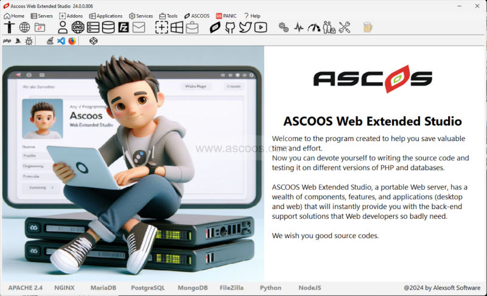
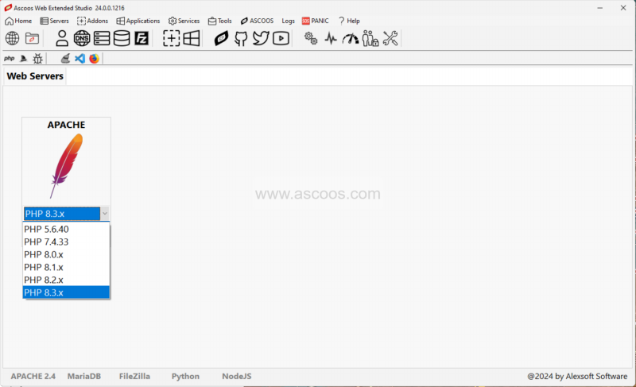
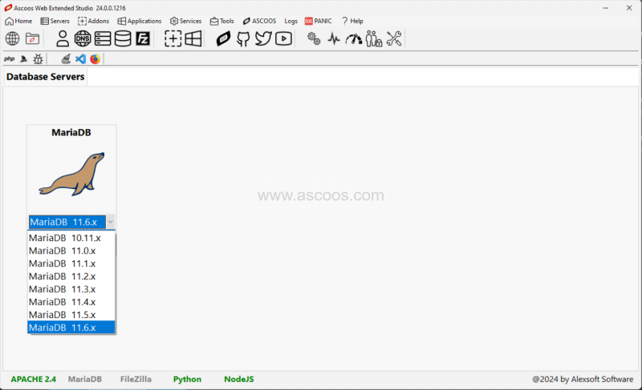

# Ascoos Web Extended Studio (AWES)

[](https://sourceforge.net/projects/ascoos-web-extended-studio/files/latest/download)
[](https://sourceforge.net/projects/ascoos-web-extended-studio/files/latest/download)
[](https://sourceforge.net/projects/ascoos-web-extended-studio/files/latest/download)
[](https://sourceforge.net/projects/ascoos-web-extended-studio/files/latest/download)

---

  

---




A powerful and reliable web server that includes a combination of web technologies such as PHP,  MariaDB, and Filezilla, capable of helping with development.

Ascoos Web Extended Studio is a rich package designed as a flexible web server for development purposes. It integrates third-party components such as PHP, MariaDB, pgSQL, MongoDB, Python, NodeJS and FileZilla and stands out through a compact installation and a well-designed admin panel.

Ascoos Web Extended Studio allows you to work with multiple versions of PHP and MariaDB without having to reinstall the package. In other words, it is possible to host newer versions of components without removing the older ones. Needless to say, this provides a great advantage to developers who want to test their application on different versions of PHP and MariaDB.

Ascoos Web Extended Studio wraps its feature set into a well-designed interface where elements are laid out in an inspired way. Web servers, databases and FTP servers can be controlled from separate sections.



By default, all services are disabled and the choice of enabling them is up to the user, depending on the current needs.

More advanced configurations are available in the Options window, where you can enable the program to stop all services on exit or start automatically on startup with your preferred PHP and MariaDB layout.


Ascoos Web Extended Studio harnesses the power of the most popular web and database architectures, bringing them together in a package that requires no installation.




# Installation

Unzip the awes.7z file to ROOT of the disk drive (C:, D:, E: F: ...) where you want to install AWES.

The final working path would look something like this: c:\AWES

Also, before running AWES, close and uninstall the service of other programs like AWS, Xampp, Wamp, etc.

```    
This program runs on 64Bit Windows as administrator.
```


## Copyright

2011-2024 by 


## Licenses
    a) ASCOOS CMS General License (AGL)
    b) ASCOOS Free License        (AGL-F)
    c) GNU General Public License (GPL)


## Features 
    - AWES GUI : Desktop GUI Control
    - AWES GUI : Web Control Information (WCI)
    - AWES GUI : Multilanguage, Skins
    
    - Apache    : Web Server
    - OpenSSL   : SSL Supports
    - PHP       : Six (6) Versions
    - IonCube   : encoder loaders for PHP
	- browscap  : Browser informations    
    - NodeJS    : As Apache CGI
    - Python    : Aas Apache CGI
    - SVN       : Code Repositories
    - MariaDB   : Three (3) Database versions
    - Filezilla : FTP Server
    - SQLite    : Database

    - phpMyAdmin        : Web Interface for MariaDB
    - Tiny File Manager : Web File Manager
    - WebSVN            : Web SVN Repository Client


# Links

### Ascoos Web Extended Studio - Official Websites
    - http://apps.ascoos.com/awes
    - https://sourceforge.net/projects/ascoos-web-extended-studio (For download)


### ASCOOS CMS - Official Websites
    - http://www.ascoos.com
    - http://www.ascoos.gr


###  Official Video Tutorials
    https://www.youtube.com/user/AscoosCms

	
